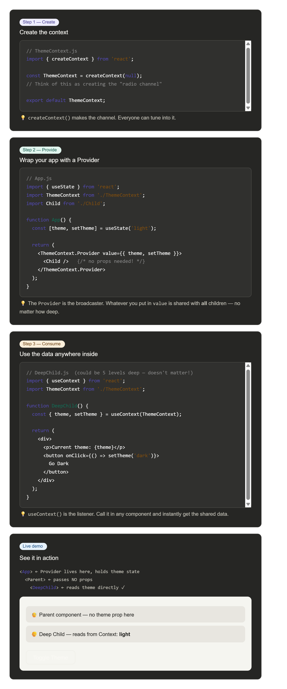

What is Context API?
Imagine you have a big family. Instead of passing a message from grandparent → parent → child → grandchild one by one, you just announce it to the whole family at once. That's Context API.
In React, normally you pass data from parent to child using props. But when you have many levels, it becomes messy (called "prop drilling"). Context API lets you share data globally without passing props at every level.

3 simple steps to use Context API
Step 1 — Create the context (the "announcement system")
Step 2 — Provide the value (the "broadcaster")
Step 3 — Consume the value (the "listener")
Here's a live example — a theme toggle app using Context API:
 

Create the context
// ThemeContext.js
import { createContext } from 'react';

const ThemeContext = createContext(null);
// Think of this as creating the "radio channel"

export default ThemeContext;

Wrap your app with a Provider
// App.js
import { useState } from 'react';
import ThemeContext from './ThemeContext';
import Child from './Child';

function App() {
  const [theme, setTheme] = useState('light');

  return (
    <ThemeContext.Provider value={{ theme, setTheme }}>
      <Child />   {/* no props needed! */}
    </ThemeContext.Provider>
  );
}

Use the data anywhere inside
// DeepChild.js  (could be 5 levels deep — doesn't matter!)
import { useContext } from 'react';
import ThemeContext from './ThemeContext';

function DeepChild() {
  const { theme, setTheme } = useContext(ThemeContext);

  return (
    

      
Current theme: {theme}

      <button onClick={() => setTheme('dark')}>
        Go Dark
      </button>
    

  );
}

See it in action
<App> ← Provider lives here, holds theme state
  <Parent> ← passes NO props
    <DeepChild> ← reads theme directly ✓

👴 Parent component — no theme prop here
👦 Deep Child — reads from Context: light

Quick summary to remember
Without Context → data goes: App → Parent → Child → DeepChild (boring long chain)
With Context → data goes: App → 🎙️ → DeepChild directly (magic shortcut)
The 3 things you always need:

createContext() — make the channel
<MyContext.Provider value={...}> — broadcast data
useContext(MyContext) — receive data anywhere

When should you use it?
Use Context when the same data is needed by many components at different levels — like: current user, theme (light/dark), language, or cart items in a shop.
Don't use it for everything though — for simple parent → child data, plain props are still fine and easier to debug.
